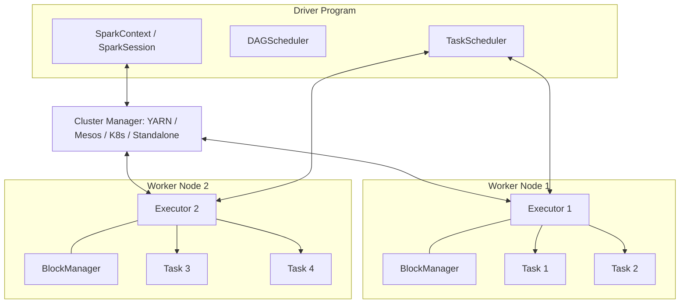
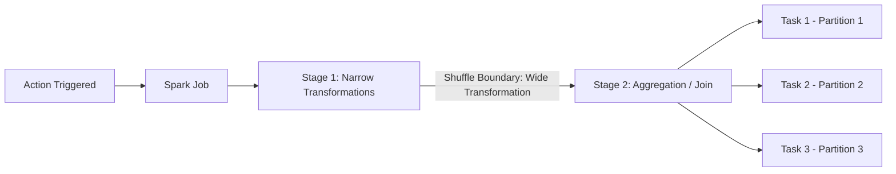
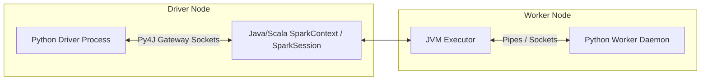
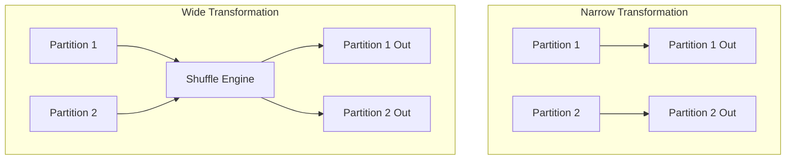
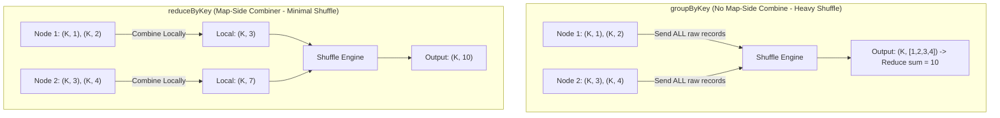
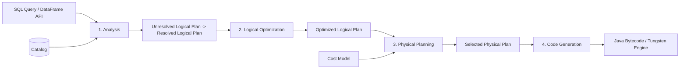
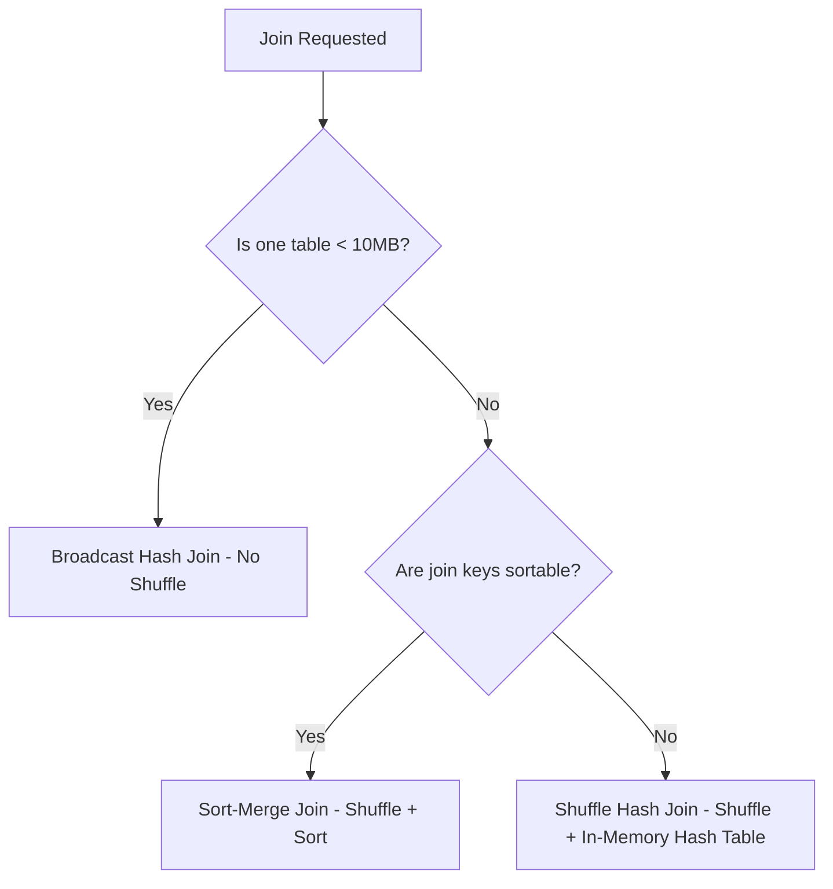
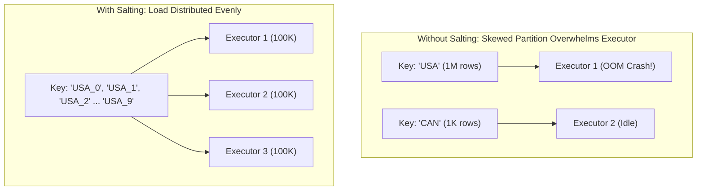
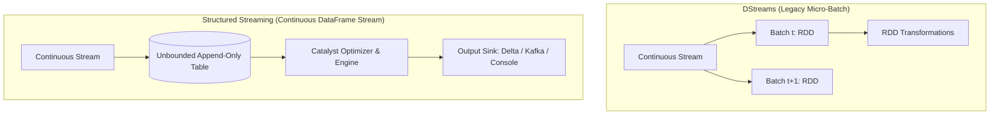
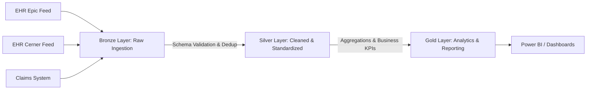

# Master PySpark & Apache Spark Comprehensive Engineering Guide
*A Unified, Best-in-Class Reference Synthesized from Complete Interview Notes, Architectural Deep Dives, Function Catalogs, and Optimization Playbooks.*

---

## Table of Contents
1. [Module 1: Spark Core & Distributed Engine Architecture](#module-1-spark-core--distributed-engine-architecture)
2. [Module 2: PySpark Internals, Runtime & Python Integration](#module-2-pyspark-internals-runtime--python-integration)
3. [Module 3: Core Data Abstractions (RDD vs. DataFrame vs. DataSet)](#module-3-core-data-abstractions-rdd-vs-dataframe-vs-dataset)
4. [Module 4: Spark SQL & The Catalyst Optimizer Deep Dive](#module-4-spark-sql--the-catalyst-optimizer-deep-dive)
5. [Module 5: DataFrame Schema Definition & Complex Types](#module-5-dataframe-schema-definition--complex-types)
6. [Module 6: Top 100+ PySpark Functions & Complete API Reference](#module-6-top-100-pyspark-functions--complete-api-reference)
7. [Module 7: Joins, Shuffling & Advanced Operations](#module-7-joins-shuffling--advanced-operations)
8. [Module 8: Caching, Persistence, Checkpointing & Shared Variables](#module-8-caching-persistence-checkpointing--shared-variables)
9. [Module 9: Master 21 Spark Optimization Techniques (With Code)](#module-9-master-21-spark-optimization-techniques-with-code)
10. [Module 10: Spark Streaming, MLlib & GraphX Ecosystem](#module-10-spark-streaming-mllib--graphx-ecosystem)
11. [Module 11: Real-World Scenarios, Bad Data Handling & Domain Case Studies](#module-11-real-world-scenarios-bad-data-handling--domain-case-studies)
12. [Module 12: High-Frequency Interview Flashcards & Problem Solving](#module-12-high-frequency-interview-flashcards--problem-solving)

---

# Module 1: Spark Core & Distributed Engine Architecture

### 1.1 What is Apache Spark?
Apache Spark is an open-source, distributed, general-purpose cluster-computing framework designed for large-scale data processing. Originally developed at UC Berkeley's AMPLab in 2009 and open-sourced under the Apache Software Foundation, Spark replaces the rigid two-stage disk-bound MapReduce paradigm with an in-memory, multi-stage DAG (Directed Acyclic Graph) execution engine.

### 1.2 Why Spark Over Hadoop MapReduce?

| Feature / Dimension | Apache Spark | Hadoop MapReduce |
| :--- | :--- | :--- |
| **Execution Speed** | Up to **100x faster in RAM**, **10x faster on disk** | Slower due to intermediate disk I/O |
| **Processing Paradigm** | In-memory DAG execution with pipelining | Multi-stage disk-bound batch execution |
| **Data Flow** | Cyclic data flow (ideal for iterative algorithms) | Acyclic 2-stage (Map $\rightarrow$ Shuffle $\rightarrow$ Reduce) |
| **Workloads** | Unified: Batch, Streaming, Interactive SQL, ML, Graphs | Primarily Batch processing |
| **Intermediate Storage** | Memory (RAM) with configurable disk spilling | Written to local disk & HDFS after each phase |
| **Caching Support** | Native `cache()` and `persist()` in memory/disk | No built-in in-memory caching |
| **Language Support** | Python, Scala, Java, R, SQL | Primarily Java (Pig/Hive add SQL-like layers) |
| **Task Startup Latency** | Low (thread-pool based inside long-running JVMs) | High (launches dedicated JVM per task) |

---

### 1.3 Spark Cluster Architecture

Spark operates in a **Master-Worker (Driver-Executor)** distributed architecture orchestrated by a pluggable Cluster Manager.



#### Core Components Breakdown:
1. **Driver Program:**
   * The central coordinator process running the application's `main()` function.
   * Instantiates `SparkContext` or `SparkSession`.
   * Converts user code into transformations and actions, generates the logical plan, converts it into a physical DAG, and translates it into physical stages and tasks.
   * Coordinates task distribution and gathers final results.
2. **Cluster Manager:**
   * Allocates physical resources (CPU, Memory) across applications.
   * Supported types: **Standalone**, **Apache Hadoop YARN**, **Apache Mesos**, **Kubernetes (K8s)**, and **Local Mode** (runs everything in single JVM for testing).
3. **Worker Nodes:**
   * Slave machines in the cluster that host executors and provide CPU/memory resources.
4. **Executors:**
   * Distributed worker JVM processes launched on worker nodes for an application.
   * Responsible for executing tasks concurrently across threads, managing in-memory cache/storage via `BlockManager`, and returning results/status to the Driver.
5. **Tasks:**
   * The fundamental unit of work sent to an executor. One task runs on one core and processes exactly **one partition** of an RDD/DataFrame.

---

### 1.4 Low-Level Subsystems & Internal Daemons
* **`DAGScheduler`:** The high-level scheduling layer that implements stage-oriented scheduling. It takes the logical RDD lineage graph, determines stage boundaries based on shuffle dependencies, and creates `TaskSets`. It operates on an event-queue architecture (`DAGSchedulerEvent`).
* **`TaskScheduler`:** The low-level scheduling layer that receives `TaskSets` from `DAGScheduler` and assigns tasks to available executor cores based on data locality.
* **`BlockManager`:** An in-memory/disk key-value storage engine running on the Driver and every Executor. It provides interfaces for putting, fetching, replicating, and dropping blocks (cached partitions, shuffle spill files, broadcast variables).
* **`MemoryStore` & `DiskStore`:** Subcomponents of `BlockManager` handling in-memory block retention and disk persistence respectively.

---

### 1.5 Data Locality (Placement Preferences)
Spark optimizes task scheduling to move computation to the data rather than moving data over the network:
1. **`PROCESS_LOCAL` (Fastest):** Data is in the same JVM process as the running task (e.g., cached in executor memory).
2. **`NODE_LOCAL`:** Data is on the same physical server (e.g., on local HDFS DataNode or local disk), requiring only local bus I/O.
3. **`RACK_LOCAL`:** Data is on a different node within the same rack, requiring top-of-rack network switch transfer.
4. **`ANY` (Slowest):** Data is anywhere on the network across racks.

---

### 1.6 Execution Hierarchy: Application $\rightarrow$ Job $\rightarrow$ Stage $\rightarrow$ Task
* **Application:** A complete user program submitted to Spark.
* **Job:** Created whenever an **Action** (e.g., `.collect()`, `.count()`, `.saveAsParquet()`) is invoked on an RDD/DataFrame.
* **Stage:** A job is split into stages based on **shuffle boundaries (Wide Transformations)**. Narrow transformations are pipelined into a single stage.
* **Task:** Individual unit of computation executed on a single partition inside an executor thread.



---

### 1.7 Deployment Modes: Client Mode vs. Cluster Mode

| Parameter | Client Mode (`--deploy-mode client`) | Cluster Mode (`--deploy-mode cluster`) |
| :--- | :--- | :--- |
| **Driver Location** | Runs locally on the client/edge machine submitting the job | Runs inside an `ApplicationMaster` / container within the cluster |
| **Network Traffic** | High latency/network load if client is outside cluster | Minimal latency (Driver is co-located with Executors) |
| **Failure Tolerance** | If client disconnects/crashes, the entire job terminates | Independent of client machine; resilient to client disconnects |
| **Primary Use Case** | Interactive development, Jupyter Notebooks, Spark Shell, debugging | **Production ETL pipelines**, scheduled enterprise batch jobs |

---

### 1.8 Cluster Sizing & Resource Calculation Formula
When allocating resources on a production cluster:
* **Given:** 10 Nodes, 16 CPU Cores per node, 64 GB RAM per node.
* **OS / System Overhead Deduction:**
  * Reserve 1 Core & 4 GB RAM per node for OS and Hadoop/YARN daemons $\rightarrow$ Available: 15 Cores, 60 GB RAM per node.
* **Optimal Cores per Executor:** Rule of thumb is **4 to 5 cores** (maintains optimal HDFS I/O throughput and avoids excessive GC pause overhead):
  $$\text{Executors per Node} = \frac{15\text{ Cores}}{5\text{ Cores/Executor}} = 3\text{ Executors/Node}$$
  $$\text{Total Application Executors} = 10\text{ Nodes} \times 3\text{ Executors/Node} - 1\text{ (for Driver in Cluster mode)} = 29\text{ Executors}$$
* **Memory per Executor:**
  $$\text{Raw Memory per Executor} = \frac{60\text{ GB}}{3\text{ Executors}} = 20\text{ GB}$$
  $$\text{Overhead (10\%)} \approx 2\text{ GB} \implies \text{Executor Memory} = 18\text{ GB}$$
* **Total Partitions Rule of Thumb:** Set partition count to **$2\times$ to $3\times$ total cores** (e.g., $150 \text{ cores} \times 2.5 \approx 375\text{ partitions}$).

---

# Module 2: PySpark Internals, Runtime & Python Integration

### 2.1 How PySpark Works (The Py4J Gateway Architecture)
PySpark is a Python API wrapping the underlying JVM-based Apache Spark engine using **Py4J**.



1. The Python Driver runs the Python code and uses **Py4J** to invoke methods on the JVM's `JavaSparkContext`.
2. When custom Python functions or Python UDFs are executed on workers, the JVM Executor spawns a **Python worker daemon**, serializes the data over Unix pipes/sockets, processes it in Python, and serializes the result back to the JVM.

---

### 2.2 Resolving Common PySpark Environment Errors

#### Issue 1: `ImportError: No module named py4j.java_gateway`
* **Root Cause:** Python cannot locate the Py4J zip package in the Spark installation directory.
* **Fix (Linux/macOS):**
  ```bash
  export SPARK_HOME=/opt/spark-3.x.x
  export PYTHONPATH=$SPARK_HOME/python:$SPARK_HOME/python/lib/py4j-*-src.zip:$PYTHONPATH
  source ~/.bashrc
  ```
* **Fix (Windows):**
  ```powershell
  set SPARK_HOME=C:\apps\spark-3.x.x
  set PYTHONPATH=%SPARK_HOME%\python;%SPARK_HOME%\python\lib\py4j-0.10.9-src.zip;%PYTHONPATH%
  ```

#### Issue 2: `NameError: name 'spark' is not defined`
* **Root Cause:** Unlike the interactive PySpark shell or Databricks (which pre-inject `spark` and `sc`), standalone scripts (`.py`) require manual instantiation.
* **Fix:**
  ```python
  from pyspark.sql import SparkSession
  spark = SparkSession.builder \
      .master("local[*]") \
      .appName("MyApp") \
      .getOrCreate()
  ```

---

### 2.3 PySpark Profilers
PySpark provides profiling capabilities to identify performance bottlenecks in Python worker processes:
* **`BasicProfiler`:** Built upon Python's native `cProfile` and Spark Accumulators.
* **Custom Profilers:** Created by subclassing `pyspark.profiler.Profiler` and implementing:
  * `profile(rdd)`: Produces execution metrics.
  * `stats()`: Returns accumulated statistical results.
  * `dump(id, path)`: Persists profile metrics to disk.
  * `add(profile)`: Merges profile results.

---

### 2.4 Core Python Refresher for Data Engineering Interviews
* **List vs. Tuple:** Lists are *mutable* (dynamic arrays), whereas tuples are *immutable* (fixed size, hashable, memory efficient, thread-safe).
* **`for...else` Construct:** The `else` block executes only if the loop finishes normally without encountering a `break` statement.
* **Custom Exception Handling:**
  ```python
  try:
      df = spark.read.schema(expected_schema).option("mode", "FAILFAST").csv("path")
  except Exception as e:
      print(f"Data ingestion error: {str(e)}")
  ```

---

# Module 3: Core Data Abstractions (RDD vs. DataFrame vs. DataSet)

### 3.1 Detailed Abstraction Comparison

| Characteristic | RDD (Resilient Distributed Dataset) | DataFrame | DataSet |
| :--- | :--- | :--- | :--- |
| **Introduced In** | Spark 1.0 | Spark 1.3 | Spark 1.6 |
| **Data Structure** | Distributed collection of raw JVM objects | Distributed tabular collection of `Row` objects with named columns | Distributed collection of strongly-typed JVM objects |
| **Schema Awareness** | **Untyped & Unaware** (no built-in schema) | **Schema-aware** (runtime type validation) | **Fully Typed** (compile-time & runtime type safety) |
| **Optimization Engine**| **None** (User defines physical plan) | **Catalyst Optimizer** & **Tungsten Engine** | **Catalyst Optimizer** & **Tungsten Engine** |
| **Serialization Overhead**| High (Java/Kryo serialization) | Low (Tungsten Off-Heap Binary Format) | Low (Tungsten Encoders) |
| **Language Availability**| Python, Scala, Java, R | Python, Scala, Java, R | Scala, Java (Not in Python/R due to dynamic typing) |
| **Performance** | Slowest for tabular & aggregation workloads | Fastest for general querying & ETL | Fast, but minor overhead compared to DF in some cases |

---

### 3.2 RDD Fundamentals: Creation, Transformations & Actions

#### RDD Creation Methods:
```python
# 1. Parallelizing an in-memory collection
rdd1 = sc.parallelize([1, 2, 3, 4, 5], numSlices=4)

# 2. Reading external files (splits by HDFS block / 128MB chunks)
rdd2 = sc.textFile("hdfs://cluster/data/file.txt", minPartitions=10)

# 3. Reading entire directory where each file becomes a (filename, content) PairRDD
rdd3 = sc.wholeTextFiles("hdfs://cluster/logs/")

# 4. Creating an empty RDD
empty_rdd = sc.emptyRDD()
empty_partitioned = sc.parallelize([], 10)
```

> [!WARNING]
> **Gzip Compression Warning:** Compressed files with non-splittable codecs (`.gz`) are read into **only 1 partition** regardless of file size. You must immediately call `.repartition(N)` after reading to restore cluster parallelism.

---

### 3.3 Narrow vs. Wide Transformations



* **Narrow Transformations:** Each input partition contributes to **at most one** output partition. Data stays on the same node without network transfer.
  * *Functions:* `map()`, `flatMap()`, `filter()`, `mapPartitions()`, `union()`.
* **Wide Transformations:** Multiple input partitions contribute to **many output partitions**. Data must be redistributed across the network (**Shuffling**).
  * *Functions:* `groupByKey()`, `reduceByKey()`, `aggregateByKey()`, `join()`, `repartition()`, `distinct()`, `cogroup()`.

---

### 3.4 `groupByKey()` vs. `reduceByKey()` vs. `aggregateByKey()`



* **`groupByKey()`:** Shuffles **all** key-value pairs across the network before grouping. Causes high network I/O and frequent `OutOfMemory` errors.
* **`reduceByKey()`:** Performs **map-side aggregation (combiner)** within each partition *before* shuffling. Only the partial aggregate per key is transferred.
* **`aggregateByKey(zeroValue)(seqOp, combOp)`:** Similar to `reduceByKey()`, but allows the output value type to differ from the input value type (e.g., input `(String, Int)`, output `(String, (Int, Double))`).

---

# Module 4: Spark SQL & The Catalyst Optimizer Deep Dive

### 4.1 What is Catalyst Optimizer?
The Catalyst Optimizer is an extensible query optimization engine at the heart of Spark SQL and DataFrame/DataSet APIs. It performs tree transformations across four distinct phases:



#### The Four Phases of Catalyst Optimization:
1. **Analysis:** Resolves table names, column names, and data types against the `Catalog` (metastore) to convert an *Unresolved Logical Plan* into a *Resolved Logical Plan*.
2. **Logical Optimization (Rule-Based):** Applies standard relational optimizations including:
   * **Predicate Pushdown:** Filters data at the storage source before loading.
   * **Projection Pruning:** Reads only required columns from columnar formats.
   * **Constant Folding & Boolean Simplification:** Evaluates constant expressions at compile-time.
3. **Physical Planning (Cost-Based & Rule-Based):** Generates multiple physical plans and selects the most efficient plan using a **Cost Model** (e.g., choosing Broadcast Hash Join over Sort-Merge Join when table size is below `spark.sql.autoBroadcastJoinThreshold`).
4. **Code Generation (Tungsten):** Compiles the optimal physical plan into clean, optimized Java bytecode using **Whole-Stage Java Code Generation**, eliminating virtual function dispatches and maximizing CPU cache locality.

---

### 4.2 Temporary Views vs. Global Temporary Views

```python
# 1. Session-Scoped Temporary View (Dropped when current SparkSession ends)
df.createOrReplaceTempView("temp_employees")
spark.sql("SELECT * FROM temp_employees WHERE salary > 50000").show()

# 2. Application-Scoped Global Temporary View (Shared across SparkSessions in the app)
df.createOrReplaceGlobalTempView("global_employees")
# Must be queried with the 'global_temp' database prefix
spark.sql("SELECT * FROM global_temp.global_employees").show()
```

---

# Module 5: DataFrame Schema Definition & Complex Types

### 5.1 Programmatic Schema Creation (`StructType` & `StructField`)
```python
from pyspark.sql.types import (
    StructType, StructField, StringType, IntegerType, 
    DoubleType, BooleanType, TimestampType, ArrayType, MapType
)

# Robust Production Schema
employee_schema = StructType([
    StructField("emp_id", IntegerType(), nullable=False),
    StructField("firstname", StringType(), nullable=True),
    StructField("lastname", StringType(), nullable=True),
    StructField("salary", DoubleType(), nullable=True),
    StructField("skills", ArrayType(StringType()), nullable=True),
    StructField("attributes", MapType(StringType(), StringType()), nullable=True)
])

df = spark.read.schema(employee_schema).csv("hdfs://path/employees.csv", header=True)
```

---

### 5.2 Handling Nested Data: JSON, Structs, Arrays & Maps

#### Nested JSON & Exploding Arrays:
```python
from pyspark.sql.functions import col, explode, explode_outer, posexplode_outer

# Reading Multi-Line JSON
json_df = spark.read.option("multiLine", "true").json("path/to/orders.json")

# Flattening an array of items
# explode() drops rows where array is null/empty; explode_outer() retains them with nulls
exploded_df = json_df.select(
    col("order_id"),
    col("customer_id"),
    explode_outer("line_items").alias("item")
)

# Selecting nested struct fields inside array
final_df = exploded_df.select(
    col("order_id"),
    col("customer_id"),
    col("item.product_id").alias("product_id"),
    col("item.quantity").alias("qty"),
    col("item.unit_price").alias("price")
)
```

---

# Module 6: Top 100+ PySpark Functions & Complete API Reference

### 6.1 Basic DataFrame CRUD & Manipulation
```python
from pyspark.sql import functions as F
from pyspark.sql.types import IntegerType

# 1. select() & alias()
df.select(F.col("name").alias("full_name"), F.col("salary")).show()

# 2. withColumn() - add or transform
df = df.withColumn("salary_bonus", F.col("salary") * 1.10)

# 3. withColumnRenamed() - single or chained
df = df.withColumnRenamed("dob", "date_of_birth")

# 4. cast() - data type conversion
df = df.withColumn("id_int", F.col("id").cast(IntegerType()))

# 5. drop() - single or multiple columns
df = df.drop("temp_col", "unused_col")

# 6. lit() - adding static constant literals
df = df.withColumn("country", F.lit("USA"))

# 7. expr() - inline SQL expression evaluation
df = df.withColumn("adjusted_salary", F.expr("salary + (salary * 0.05)"))
```

---

### 6.2 Conditional & Filtering Functions
```python
# 8. filter() / where()
df_filtered = df.filter(F.col("salary") > 50000)
df_multi = df.filter((F.col("age") >= 21) & (F.col("status") == "ACTIVE"))

# 9. when() / otherwise() - Conditional Case Statement
df_tiered = df.withColumn(
    "salary_tier",
    F.when(F.col("salary") >= 100000, "Tier 1")
     .when((F.col("salary") >= 50000) & (F.col("salary") < 100000), "Tier 2")
     .otherwise("Tier 3")
)

# 10. between()
df.filter(F.col("age").between(25, 40)).show()

# 11. startsWith() / endsWith() / contains()
df.filter(F.col("name").startswith("Dr.")).show()
df.filter(F.col("email").endswith("@company.com")).show()
df.filter(F.col("description").contains("urgent")).show()

# 12. like() & rlike() (Regex Matching)
df.filter(F.col("name").like("J%")).show()
df.filter(F.col("phone").rlike("^[0-9]{3}-[0-9]{3}-[0-9]{4}$")).show()
```

---

### 6.3 Data Cleaning & Null Handling
```python
# 13. isNull() & isNotNull()
df_nulls = df.filter(F.col("email").isNull())
df_valid = df.filter(F.col("email").isNotNull())

# 14. fillna() / na.fill()
df_clean = df.fillna({"salary": 0.0, "status": "UNKNOWN", "department": "Unassigned"})

# 15. dropna() / na.drop()
df_dropped = df.dropna(how="any", subset=["emp_id", "email"])

# 16. distinct() vs dropDuplicates()
df_distinct = df.distinct() # All columns
df_dedup = df.dropDuplicates(subset=["emp_id", "department_id"]) # Subset of columns
```

---

### 6.4 Aggregations & Statistical Analysis
```python
# 17. groupBy() with multi-column aggregations
agg_df = df.groupBy("department_id").agg(
    F.count("emp_id").alias("total_employees"),
    F.sum("salary").alias("total_payroll"),
    F.avg("salary").alias("avg_salary"),
    F.min("salary").alias("min_salary"),
    F.max("salary").alias("max_salary"),
    F.stddev("salary").alias("salary_stddev"),
    F.variance("salary").alias("salary_variance")
)

# 18. countDistinct() & approx_count_distinct()
df.select(
    F.countDistinct("customer_id").alias("exact_unique_customers"),
    F.approx_count_distinct("customer_id", rsd=0.05).alias("approx_unique_customers")
).show()

# 19. collect_list() vs collect_set()
df.groupBy("department_id").agg(
    F.collect_list("name").alias("all_employee_names"), # Preserves duplicates
    F.collect_set("name").alias("unique_employee_names") # Removes duplicates
).show()

# 20. Statistical Covariance, Correlation, Skewness, Kurtosis
df.select(
    F.corr("age", "salary").alias("age_salary_corr"),
    F.covar_samp("age", "salary").alias("age_salary_sample_covar"),
    F.skewness("salary").alias("salary_skewness"),
    F.kurtosis("salary").alias("salary_kurtosis")
).show()

# 21. approxQuantile() - Calculate percentiles (25th, 50th, 75th)
quantiles = df.approxQuantile("salary", [0.25, 0.50, 0.75], relativeError=0.01)
```

---

### 6.5 Window Functions Catalog
Window functions calculate metrics across partitions without collapsing individual rows:

```python
from pyspark.sql.window import Window

# Window Specification
dept_window = Window.partitionBy("department_id").orderBy(F.col("salary").desc())
time_window = Window.partitionBy("patient_id").orderBy("encounter_date")
sliding_window = Window.partitionBy("department_id").orderBy("salary") \
    .rowsBetween(Window.unboundedPreceding, Window.currentRow)

# 22. row_number(), rank(), dense_rank()
df_ranked = df.withColumn("row_num", F.row_number().over(dept_window)) \
              .withColumn("rank", F.rank().over(dept_window)) \
              .withColumn("dense_rank", F.dense_rank().over(dept_window))

# 23. ntile() & percent_rank()
df_ranked = df_ranked.withColumn("salary_bucket", F.ntile(4).over(dept_window)) \
                     .withColumn("pct_rank", F.percent_rank().over(dept_window))

# 24. lag() & lead()
df_history = df.withColumn("prev_visit_date", F.lag("encounter_date", 1).over(time_window)) \
               .withColumn("next_visit_date", F.lead("encounter_date", 1).over(time_window))

# 25. Running Cumulative Total & Window Boundaries
df_running = df.withColumn("running_payroll", F.sum("salary").over(sliding_window))
```

> [!NOTE]
> **Difference Between Ranking Functions:**
> * `row_number()`: Strict sequential numbering $[1, 2, 3, 4]$. Ties are arbitrarily numbered.
> * `rank()`: Shared ranking with gaps after ties $[1, 2, 2, 4]$.
> * `dense_rank()`: Shared ranking without gaps $[1, 2, 2, 3]$.

---

### 6.6 String Manipulation Functions
```python
# 26. concat() & concat_ws()
df = df.withColumn("full_name", F.concat_ws(" ", F.col("first_name"), F.col("last_name")))

# 27. String Case & Trimming
df = df.withColumn("name_upper", F.upper(F.col("name"))) \
       .withColumn("name_lower", F.lower(F.col("name"))) \
       .withColumn("name_initcap", F.initcap(F.col("name"))) \
       .withColumn("clean_str", F.trim(F.col("raw_str"))) \
       .withColumn("ltrimmed", F.ltrim(F.col("raw_str"))) \
       .withColumn("rtrimmed", F.rtrim(F.col("raw_str")))

# 28. Substring & Length
df = df.withColumn("str_len", F.length(F.col("code"))) \
       .withColumn("sub_code", F.substring(F.col("code"), 1, 3))

# 29. Regex Replace & Extract
df = df.withColumn("cleaned_phone", F.regexp_replace(F.col("phone"), "[^0-9]", "")) \
       .withColumn("domain", F.regexp_extract(F.col("email"), "@([a-zA-Z0-9.-]+)", 1))

# 30. Padding & Repeat
df = df.withColumn("padded_id", F.lpad(F.col("id"), 8, "0")) \
       .withColumn("r_padded", F.rpad(F.col("name"), 20, "X")) \
       .withColumn("echo", F.repeat(F.col("status"), 3))

# 31. String Reversal, Translation & Soundex
df = df.withColumn("reversed", F.reverse(F.col("name"))) \
       .withColumn("translated", F.translate(F.col("name"), "abc", "xyz")) \
       .withColumn("soundex_code", F.soundex(F.col("name")))
```

---

### 6.7 Date and Timestamp Functions
```python
# 32. Current Dates & Conversions
df = df.withColumn("current_dt", F.current_date()) \
       .withColumn("current_ts", F.current_timestamp()) \
       .withColumn("parsed_date", F.to_date(F.col("date_str"), "dd-MM-yyyy")) \
       .withColumn("parsed_ts", F.to_timestamp(F.col("ts_str"), "yyyy-MM-dd HH:mm:ss"))

# 33. Date Arithmetic
df = df.withColumn("date_plus_30", F.date_add(F.col("parsed_date"), 30)) \
       .withColumn("date_minus_7", F.date_sub(F.col("parsed_date"), 7)) \
       .withColumn("next_month", F.add_months(F.col("parsed_date"), 1)) \
       .withColumn("days_diff", F.datediff(F.col("end_date"), F.col("start_date"))) \
       .withColumn("months_diff", F.months_between(F.col("end_date"), F.col("start_date")))

# 34. Date Parts Extraction
df = df.withColumn("yr", F.year(F.col("parsed_date"))) \
       .withColumn("mo", F.month(F.col("parsed_date"))) \
       .withColumn("dy", F.dayofmonth(F.col("parsed_date"))) \
       .withColumn("day_wk", F.dayofweek(F.col("parsed_date"))) \
       .withColumn("wk_yr", F.weekofyear(F.col("parsed_date"))) \
       .withColumn("hr", F.hour(F.col("parsed_ts"))) \
       .withColumn("min", F.minute(F.col("parsed_ts"))) \
       .withColumn("sec", F.second(F.col("parsed_ts")))

# 35. Date Truncation & Formatting
df = df.withColumn("month_start", F.trunc(F.col("parsed_date"), "MM")) \
       .withColumn("year_start", F.trunc(F.col("parsed_date"), "YEAR")) \
       .withColumn("formatted_date", F.date_format(F.col("parsed_date"), "MMMM dd, yyyy")) \
       .withColumn("last_day_of_month", F.last_day(F.col("parsed_date"))) \
       .withColumn("next_monday", F.next_day(F.col("parsed_date"), "Mon"))

# 36. Unix Timestamps
df = df.withColumn("epoch_sec", F.unix_timestamp(F.col("parsed_ts"))) \
       .withColumn("ts_from_epoch", F.from_unixtime(F.col("epoch_sec")))
```

---

### 6.8 Array & Collection Functions
```python
# 37. Creating Arrays & Checking Membership
df = df.withColumn("full_array", F.array(F.col("col_a"), F.col("col_b"))) \
       .withColumn("has_spark", F.array_contains(F.col("skills"), "Spark"))

# 38. Array Transformations
df = df.withColumn("unique_skills", F.array_distinct(F.col("skills"))) \
       .withColumn("common_skills", F.array_intersect(F.col("skills_a"), F.col("skills_b"))) \
       .withColumn("all_skills", F.array_union(F.col("skills_a"), F.col("skills_b")))
```

---

# Module 7: Joins, Shuffling & Advanced Operations

### 7.1 Comprehensive Join Types in PySpark

```python
# Join Syntax: df1.join(df2, on_condition, how)

# 1. Inner Join (Returns matching records from both sides)
inner_df = df1.join(df2, df1["id"] == df2["id"], "inner")

# 2. Left Outer Join (Returns all left rows, matched right rows or nulls)
left_df = df1.join(df2, "id", "left")

# 3. Right Outer Join (Returns all right rows, matched left rows or nulls)
right_df = df1.join(df2, "id", "right")

# 4. Full Outer Join (Returns all rows from both tables)
full_df = df1.join(df2, "id", "outer")

# 5. Left Semi Join (Returns only left rows that have a match in right table - NO right columns appended)
semi_df = df1.join(df2, "id", "left_semi")

# 6. Left Anti Join (Returns only left rows that DO NOT have a match in right table)
anti_df = df1.join(df2, "id", "left_anti")

# 7. Cross Join (Cartesian Product: N x M rows - EXTREMELY EXPENSIVE)
cross_df = df1.crossJoin(df2)
```

---

### 7.2 Spark Join Execution Strategies



1. **Broadcast Hash Join (BHJ):**
   * The small DataFrame is broadcasted to all executor nodes. Each executor builds an in-memory hash table. **No network shuffle of the large DataFrame.**
   * Triggered automatically if table size $\le$ `spark.sql.autoBroadcastJoinThreshold` (default 10 MB) or via explicit hint: `df1.join(F.broadcast(df2), "id")`.
2. **Sort-Merge Join (SMJ):**
   * Default join strategy for large datasets in Spark.
   * Phase 1: Shuffle data across nodes on join keys. Phase 2: Sort partitions by key. Phase 3: Merge sorted partitions linearly.
3. **Shuffle Hash Join:**
   * Shuffles both datasets and builds a hash map on the smaller partition. Used when keys are not sortable or memory allows.

---

### 7.3 Chained Joins Across Multiple Tables
```python
final_dataset = (
    empDF.join(deptDF, empDF["emp_dept_id"] == deptDF["dept_id"], "left")
         .join(addressDF, empDF["emp_id"] == addressDF["emp_id"], "left")
         .select(
             empDF["emp_id"],
             empDF["emp_name"],
             deptDF["dept_name"],
             addressDF["city"],
             addressDF["state"]
         )
)
```

---

# Module 8: Caching, Persistence, Checkpointing & Shared Variables

### 8.1 Caching vs. Persistence vs. Checkpointing

| Dimension | `cache()` | `persist()` | `checkpoint()` |
| :--- | :--- | :--- | :--- |
| **Storage Target** | Memory (`MEMORY_ONLY`) | User-defined storage levels (RAM, Disk, Off-heap) | Reliable Distributed Storage (HDFS/S3) |
| **Lineage Impact** | Preserves DAG Lineage | Preserves DAG Lineage | **Truncates & Breaks DAG Lineage** |
| **Recovery Mechanism**| Recomputes lost partitions using lineage graph | Recomputes lost partitions using lineage graph | Re-reads directly from persistent checkpoint file |
| **Primary Use Case** | Reused DataFrames across iterative ML/analytics | Data exceeding memory or requiring replication | Stateful Streaming, Long Lineage DAGs (preventing stack overflow) |

---

### 8.2 PySpark Storage Levels Reference

```python
from pyspark import StorageLevel

# Available Storage Levels:
# 1. MEMORY_ONLY: Deserialized Java objects in JVM RAM (Default for RDD cache)
# 2. MEMORY_ONLY_SER: Serialized byte array in JVM RAM (Space-efficient, higher CPU overhead)
# 3. MEMORY_AND_DISK: Spills partitions that do not fit in RAM to local disk (Default for DataFrame cache)
# 4. MEMORY_AND_DISK_SER: Serialized in RAM, spills to disk
# 5. DISK_ONLY: Stores partitions exclusively on local disk
# 6. OFF_HEAP: Stores serialized objects in off-heap memory (outside JVM GC)
# 7. _2 Suffix (e.g. MEMORY_AND_DISK_2): Replicates each partition on TWO cluster nodes for high fault tolerance

df.persist(StorageLevel.MEMORY_AND_DISK)
df.count() # Materialize cache
# Always unpersist when finished!
df.unpersist()
```

---

### 8.3 Shared Variables: Broadcast Variables & Accumulators

#### Broadcast Variables (Read-Only Shared Lookup Tables)
```python
# Broadcast lookup dictionary from Driver to all Executors
zip_code_map = {"10001": "New York", "94102": "San Francisco", "60601": "Chicago"}
broadcast_zips = sc.broadcast(zip_code_map)

# Usage inside transformation
def get_city(zip_code):
    return broadcast_zips.value.get(zip_code, "Unknown")

# Access in RDD / UDF
mapped_rdd = df.rdd.map(lambda row: (row.id, get_city(row.zip_code)))
```

#### Accumulators (Write-Only Distributed Counters)
```python
# Initialize Named Accumulator on Driver
error_counter = sc.accumulator(0)
corrupt_records = sc.accumulator(0)

def validate_record(row):
    global corrupt_records
    if row.salary is None or row.salary < 0:
        corrupt_records.add(1)
        return False
    return True

valid_rdd = df.rdd.filter(validate_record)
valid_rdd.collect() # Trigger Action

print(f"Total Corrupt Records Found: {corrupt_records.value}")
```

> [!IMPORTANT]
> **Accumulator Interview Rules:**
> * Worker tasks can only **write/add** to accumulators (`ac.add(1)`).
> * Only the **Driver** program can read an accumulator's value (`ac.value`).
> * Inside transformations (lazy), accumulators may execute multiple times if a partition is recomputed. Place accumulators inside actions (e.g., `foreach`) for exact counting.

---

# Module 9: Master 21 Spark Optimization Techniques (With Code)

### 1. Partition Tuning (`repartition()` vs. `coalesce()`)
* **`repartition(N)`:** Performs a full shuffle to evenly distribute data across $N$ partitions. Used to **increase** partitions or balance skewed data.
* **`coalesce(N)`:** Reduces the number of partitions **without a full shuffle** by merging adjacent partitions on the same worker node.
```python
# Increase partitions before heavy computation
df_repart = df.repartition(200, "region_id")

# Reduce partitions before writing output to disk to avoid small files
df_coalesced = df_repart.coalesce(10)
```

---

### 2. Strategic Caching & Persistence
```python
from pyspark import StorageLevel

# Cache only DataFrames that are reused multiple times in iterative workflows
df_cached = df.filter(F.col("active") == True).persist(StorageLevel.MEMORY_AND_DISK)
df_cached.count() # Force materialization
```

---

### 3. Broadcast Hash Joins
```python
# Avoid shuffle joins when joining a large dataset with a small dimension table (< 10MB default)
large_df.join(F.broadcast(small_dim_df), "department_id", "left").show()
```

---

### 4. Avoiding Shuffles & Preferring Map-Side Combine
Avoid `groupByKey()` on RDDs; always use `reduceByKey()` or `aggregateByKey()` to aggregate locally on worker nodes prior to network transfer:
```python
# BAD: High shuffle volume
rdd.groupByKey().mapValues(sum)

# GOOD: Map-side combined shuffle
rdd.reduceByKey(lambda a, b: a + b)
```

---

### 5. Columnar & Splittable File Formats (Parquet / ORC)
Always prefer columnar, splittable, schema-embedded binary formats (Parquet or ORC) with **Snappy** compression over CSV/JSON:
```python
df.write.mode("overwrite").parquet("hdfs://path/curated_data/")
```

---

### 6. Predicate Pushdown (Source-Level Filtering)
Push filters down to the database or storage engine so unused data is never loaded into Spark memory:
```python
# Automatically pushed down into Parquet file footers / JDBC queries
df = spark.read.parquet("hdfs://path/sales.parquet").filter(F.col("year") == 2025)
```

---

### 7. Vectorized Pandas UDFs (Apache Arrow)
Standard Python UDFs process data row-by-row with high serialization overhead. **Pandas UDFs** use **Apache Arrow** to vectorize computations in batch:
```python
from pyspark.sql.functions import pandas_udf
import pandas as pd

@pandas_udf("double")
def vectorized_add_tax(salary: pd.Series) -> pd.Series:
    return salary * 1.18

df = df.withColumn("salary_with_tax", vectorized_add_tax(F.col("salary")))
```

---

### 8. Minimizing `explode()` Operations
Exploding arrays expands row count massively. Always pre-filter data before calling `explode()`:
```python
# Filter first, then explode
filtered_df = df.filter(F.col("status") == "ACTIVE")
exploded_df = filtered_df.withColumn("item", F.explode("items"))
```

---

### 9. Leveraging the Tungsten Execution Engine
Tungsten manages memory off-heap in compact binary formats, bypassing Java JVM garbage collection overhead. Using DataFrames/DataSets automatically utilizes Tungsten.

---

### 10. Adaptive Query Execution (AQE)
Available in Spark 3.0+, AQE re-optimizes query plans at runtime based on completed stage statistics:
```python
spark.conf.set("spark.sql.adaptive.enabled", "true")
spark.conf.set("spark.sql.adaptive.coalescePartitions.enabled", "true")
spark.conf.set("spark.sql.adaptive.skewJoin.enabled", "true")
```

---

### 11. Dynamic Partition Pruning (DPP)
Prunes entire physical partitions from the fact table at runtime based on the filtered result of a dimension table:
```python
spark.conf.set("spark.sql.optimizer.dynamicPartitionPruning.enabled", "true")
```

---

### 12. Handling Data Skew with Salting
When join/group keys are unevenly distributed (e.g. 80% null or popular keys), append a random "salt" key to distribute the hot key across multiple partitions:



```python
from pyspark.sql.functions import concat, lit, rand, floor

# Step 1: Add salt (0 to 9) to the skewed key on the large table
df_large_salted = df_large.withColumn("salt", F.floor(F.rand() * 10))
df_large_salted = df_large_salted.withColumn("salted_key", F.concat(F.col("skewed_key"), F.lit("_"), F.col("salt")))

# Step 2: Replicate the lookup dimension table 10x with salt values
df_small_exploded = df_small.withColumn("salt_array", F.array([F.lit(i) for i in range(10)]))
df_small_replicated = df_small_exploded.withColumn("salt", F.explode("salt_array"))
df_small_replicated = df_small_replicated.withColumn("salted_key", F.concat(F.col("skewed_key"), F.lit("_"), F.col("salt")))

# Step 3: Perform uniform, non-skewed join
result_df = df_large_salted.join(df_small_replicated, "salted_key").drop("salt", "salted_key")
```

---

### 13. Kryo Serialization
Replace default Java serialization with Kryo to speed up shuffling and caching by up to 10x:
```python
spark.conf.set("spark.serializer", "org.apache.spark.serializer.KryoSerializer")
```

---

### 14. Shuffle Partition Sizing
Default `spark.sql.shuffle.partitions` is 200. For smaller datasets, reduce this to prevent creating thousands of tiny empty partitions:
```python
spark.conf.set("spark.sql.shuffle.partitions", "50")
```

---

### 15. Preferring Built-In SQL Functions over Python UDFs
Native built-in functions execute directly inside the JVM using Tungsten bytecode generation with zero serialization penalty. Always use built-in functions before writing custom UDFs:
```python
# BAD: Python UDF
@F.udf("string")
def custom_upper(s):
    return s.upper() if s else None
df.withColumn("upper_name", custom_upper("name"))

# GOOD: Native Spark Built-In Function
df.withColumn("upper_name", F.upper(F.col("name")))
```

---

### 16. Speculative Execution for Stragglers
```python
spark.conf.set("spark.speculation", "true")
spark.conf.set("spark.speculation.interval", "100ms")
spark.conf.set("spark.speculation.multiplier", "1.5")
```

---

### 17. Sizing Driver Max Result Size
Prevent Driver crash when collecting large action results:
```python
spark.conf.set("spark.driver.maxResultSize", "4g")
```

---

### 18. Automatic Metadata Cleanup
```python
# Prevent long-running streaming/batch driver OOM due to accumulated metadata
spark.conf.set("spark.cleaner.ttl", "86400") # 24 hours in seconds
```

---

### 19. Bucketing for Repeated Joins
Pre-shuffle and sort data into buckets during write to eliminate runtime shuffling in future joins:
```python
df.write.bucketBy(50, "customer_id").sortBy("transaction_date").saveAsTable("bucketed_transactions")
```

---

### 20. Cost-Based Optimizer (CBO) Statistics
```sql
ANALYZE TABLE employees COMPUTE STATISTICS FOR COLUMNS department_id, salary;
```

---

### 21. Dynamic Allocation of Executors
Scale cluster resources up and down based on task workload:
```properties
spark.dynamicAllocation.enabled=true
spark.dynamicAllocation.minExecutors=2
spark.dynamicAllocation.maxExecutors=50
spark.dynamicAllocation.executorIdleTimeout=60s
```

---

# Module 10: Spark Streaming, MLlib & GraphX Ecosystem

### 10.1 Spark Streaming: DStreams vs. Structured Streaming



#### Structured Streaming Core Example:
```python
# Streaming Read from Socket / Kafka
stream_df = spark.readStream \
    .format("kafka") \
    .option("kafka.bootstrap.servers", "broker:9092") \
    .option("subscribe", "telemetry") \
    .load()

# Streaming Windowed Aggregation with Watermarking
windowed_counts = (
    stream_df.withWatermark("timestamp", "10 minutes")
             .groupBy(F.window("timestamp", "5 minutes", "1 minute"), "device_id")
             .count()
)

# Streaming Write with Checkpointing
query = windowed_counts.writeStream \
    .outputMode("update") \
    .format("console") \
    .option("checkpointLocation", "hdfs://path/to/checkpoint_dir") \
    .start()
```

* **Watermarking:** Defines the lateness threshold (e.g., `"10 minutes"`). Late data arriving within the watermark is aggregated; data older than the watermark is dropped from the state store to free memory.

---

### 10.2 Spark MLlib: Pipelines, Vectors & Matrices
* **Dense Vector:** Stores all elements sequentially: `Vectors.dense([1.0, 0.0, 3.0])`.
* **Sparse Vector:** Stores only non-zero values with indices to conserve RAM: `Vectors.sparse(size=5, indices=[0, 4], values=[1.0, 2.0])`.
* **ML Pipelines Workflow:**
  * **Transformer:** Transforms one DataFrame into another (e.g., `Tokenizer`, `VectorAssembler`).
  * **Estimator:** Fits on a DataFrame to produce a `Model` (which is itself a Transformer, e.g., `LogisticRegression.fit()`).

```python
from pyspark.ml import Pipeline
from pyspark.ml.feature import VectorAssembler, StandardScaler
from pyspark.ml.classification import LogisticRegression

# 1. Feature Engineering
assembler = VectorAssembler(inputCols=["age", "salary", "experience"], outputCol="features")
scaler = StandardScaler(inputCol="features", outputCol="scaled_features")

# 2. Estimator Model
lr = LogisticRegression(featuresCol="scaled_features", labelCol="label")

# 3. Pipeline Construction & Fit
pipeline = Pipeline(stages=[assembler, scaler, lr])
model = pipeline.fit(training_df)
predictions = model.transform(test_df)
```

---

### 10.3 Spark GraphX: Property Graph & PageRank
GraphX extends RDDs with the **Resilient Distributed Property Graph** consisting of:
* **Vertex RDD (`RDD[(VertexId, VD)]`):** Holds vertex properties.
* **Edge RDD (`RDD[Edge[ED]]`):** Holds directed edges `(srcId, dstId, property)`.
* **PageRank in Spark:** Computes influence of vertices iteratively based on incoming links.

```scala
// Scala GraphX PageRank
val graph = Graph(vertexRDD, edgeRDD)
val ranks = graph.pageRank(tol = 0.005).vertices
ranks.take(10).foreach(println)
```

---

# Module 11: Real-World Scenarios, Bad Data Handling & Domain Case Studies

### 11.1 Handling Bad, Malformed & Corrupted Data
When reading raw CSV/JSON files, Spark provides 3 distinct modes:
1. **`PERMISSIVE` (Default):** Sets corrupt fields to `null` and records bad rows in a dedicated column (`_corrupt_record`).
2. **`DROPMALFORMED`:** Silently ignores and drops corrupt records.
3. **`FAILFAST`:** Immediately throws an exception and halts execution upon encountering a corrupt row.

```python
# Robust Production Ingestion with Corrupt Record Capture
schema_with_corrupt = StructType([
    StructField("id", IntegerType(), True),
    StructField("name", StringType(), True),
    StructField("salary", DoubleType(), True),
    StructField("_corrupt_record", StringType(), True) # Column for bad data
])

df = spark.read \
    .schema(schema_with_corrupt) \
    .option("mode", "PERMISSIVE") \
    .option("columnNameOfCorruptRecord", "_corrupt_record") \
    .csv("path/to/incoming_feed.csv", header=True)

# Separate Clean vs Corrupted Data
valid_records = df.filter(F.col("_corrupt_record").isNull()).drop("_corrupt_record")
quarantine_records = df.filter(F.col("_corrupt_record").isNotNull())
```

---

### 11.2 Merging Datasets with Mismatched Schemas
```python
# Combining two files with differing column structures
# File 1: Name, Age
# File 2: Name, Age, Gender

df1 = spark.read.option("header", "true").csv("file1.csv")
df2 = spark.read.option("header", "true").csv("file2.csv")

# Solution 1: unionByName with missing columns enabled (Spark 3.1+)
merged_df = df1.unionByName(df2, allowMissingColumns=True)

# Solution 2: Explicit Column Alignment via lit(None)
for col_name in df2.columns:
    if col_name not in df1.columns:
        df1 = df1.withColumn(col_name, F.lit(None).cast("string"))

for col_name in df1.columns:
    if col_name not in df2.columns:
        df2 = df2.withColumn(col_name, F.lit(None).cast("string"))

merged_df = df1.select(df2.columns).union(df2)
```

---

### 11.3 Multi-Character Custom Delimiter Parsing
```python
# Custom Delimiter: '~|'
# Read as raw text, split using regex, and convert to structured DataFrame
raw_df = spark.read.text("path/to/custom_file.txt")

header = raw_df.first()[0]
columns = [c.strip() for c in header.split("~|")]

data_df = raw_df.filter(F.col("value") != header) \
                .rdd.map(lambda row: row[0].split("~|")) \
                .toDF(columns)
```

---

### 11.4 Healthcare Domain Case Study: Medallion Architecture (Bronze $\rightarrow$ Silver $\rightarrow$ Gold)



#### Healthcare Problem 1: Patient Deduplication & Retaining Latest Record
Multiple EHR feeds emit updates for the same patient throughout the day. Retain only the latest valid encounter record:
```python
from pyspark.sql.window import Window

patient_window = Window.partitionBy("patient_id").orderBy(
    F.col("encounter_date").desc(),
    F.col("updated_timestamp").desc()
)

deduped_patients_df = (
    bronze_patients_df.withColumn("rn", F.row_number().over(patient_window))
                      .filter(F.col("rn") == 1)
                      .drop("rn")
)
```

#### Healthcare Problem 2: 30-Day Readmission Analysis via `lag()`
Identify whether a patient was readmitted within 30 days of their previous discharge:
```python
readmission_window = Window.partitionBy("patient_id").orderBy("admission_date")

readmissions_df = encounters_df.withColumn(
    "prev_discharge_date",
    F.lag("discharge_date", 1).over(readmission_window)
).withColumn(
    "days_since_last_discharge",
    F.datediff(F.col("admission_date"), F.col("prev_discharge_date"))
).withColumn(
    "is_30_day_readmission",
    F.when((F.col("days_since_last_discharge") <= 30) & (F.col("days_since_last_discharge") >= 0), 1).otherwise(0)
)
```

---

# Module 12: High-Frequency Interview Flashcards & Problem Solving

### Flashcard 1: Why is DataFrame faster than RDD?
> **Answer:** DataFrames utilize the **Catalyst Optimizer** (which performs logical optimization, predicate pushdown, projection pruning, and cost-based join selection) and the **Tungsten Engine** (which compiles query plans into optimized JVM bytecode and operates directly on off-heap binary memory, eliminating Java serialization and GC overhead). RDDs lack query optimization and incur heavy serialization costs.

---

### Flashcard 2: How do you identify if an operation is a Transformation or an Action?
> **Answer:** Check the return type. If the function returns a new **RDD, DataFrame, or Dataset**, it is a **Transformation** (lazy). If it returns a scalar value, collection, writes data, or returns `Unit`/`None` to the Driver (e.g., `count()`, `collect()`, `take()`, `first()`, `save()`, `show()`), it is an **Action** (triggers execution).

---

### Flashcard 3: What is the difference between `repartition()` and `coalesce()`?
> **Answer:** `repartition(N)` can increase or decrease partitions by executing a **full network shuffle**, resulting in evenly balanced partitions. `coalesce(N)` can only **decrease** partitions by merging local partitions on worker nodes without a full shuffle, making it substantially faster for reducing file output count.

---

### Flashcard 4: How does Spark achieve fault tolerance without data replication?
> **Answer:** Spark uses **RDD Lineage Graphs** (`rdd.toDebugString()`). Because RDDs are deterministic and immutable, if an executor node fails, Spark does not need to replicate the entire dataset across nodes; it simply recomputes only the lost partitions using the upstream lineage operations.

---

### Flashcard 5: How do you track and debug failed jobs in Spark?
> **Answer:**
> 1. Open the **Spark Web UI** (`http://<driver-ip>:4040`).
> 2. Inspect the **Stages** tab to identify failed stages and check task failure error traces.
> 3. Check for **Data Skew**: Look for stages where max task execution time or shuffle read size is significantly higher than the 75th percentile / median.
> 4. Inspect driver and executor log files (`stdout` / `stderr`) in YARN/K8s resource manager.

---

### Flashcard 6: Complete Distributed Word Count Problem
```python
# RDD Implementation
counts_rdd = sc.textFile("hdfs://path/text.txt") \
               .flatMap(lambda line: line.split(" ")) \
               .filter(lambda word: len(word.strip()) > 0) \
               .map(lambda word: (word.lower(), 1)) \
               .reduceByKey(lambda a, b: a + b)

# DataFrame Implementation
counts_df = spark.read.text("hdfs://path/text.txt") \
                 .select(F.explode(F.split(F.col("value"), "\\s+")).alias("word")) \
                 .filter(F.length("word") > 0) \
                 .groupBy(F.lower("word").alias("word")) \
                 .count()
```

---
*End of Master Reference Guide.*
